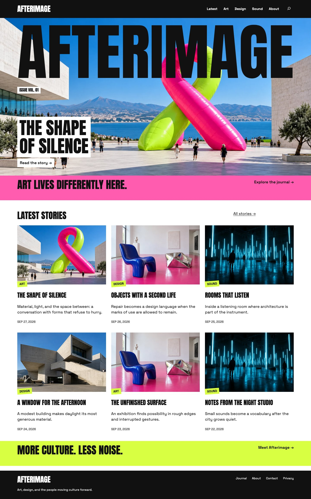

# Whole-Site Canvas Compositions

Canvas supports native WordPress flow content and nested Canvas sections. A real Query can sit in Canvas, while each result uses a Canvas composition inside Post Template. Post Content, search, comments, and template-part references keep their native WordPress rendering and editing behavior.

## Structure

```html
<!-- wp:tabor/canvas -->
<!-- wp:query {"query":{"perPage":3,"postType":"post","inherit":false}} -->
<div class="wp-block-query">
<!-- wp:post-template -->
<!-- wp:tabor/canvas -->
<!-- wp:post-featured-image {"isLink":true} /-->
<!-- wp:post-title {"isLink":true} /-->
<!-- wp:post-excerpt /-->
<!-- /wp:tabor/canvas -->
<!-- /wp:post-template -->
</div>
<!-- /wp:query -->
<!-- /wp:tabor/canvas -->
```

This is a structural example; add deliberate placements and verify the design at desktop, tablet, and mobile sizes. Native forms, pagination, and loop descendants retain their registered parent/ancestor relationships. Canvas does not replace a query with static stories or flatten Post Content into copied text.

Natural-height blocks measure their complete content. Their authored row spans establish minimum frames; readable layout grows to clear longer text and result lists. Nested grids reset inherited precise-frame properties and own their scaling, measurement, selection, and keyboard handlers. Changes to a parent's layout must not rewrite inner placement metadata.

Native excerpts extract readable text from Canvas and nested Canvas wrappers, while leaving manual excerpts and WordPress's dynamic-block exclusions intact. Intrinsic measurement uses untransformed dimensions, so rotated content does not acquire an inflated natural height. Open native navigation overlays temporarily release Canvas ancestor transforms and stacking isolation so the menu can cover the viewport; closing the menu restores the authored composition.

## Verification

Run `npm run check`, `npm run test:abilities`, and `npm run test:flow`. The portable flow check starts its own pinned WordPress Playground, renders real repeated Canvas query cards, opens native editors, expands article content at multiple widths, and checks global typography changes. It also checks native excerpt extraction and opens direct and nested rotated navigation menus, verifying viewport coverage, visible link hit-testing, Escape, and focus restoration. It shuts its server down afterward. Chromium must be installed with `npx playwright install chromium` (use `--with-deps` on Linux); CI runs the abilities and flow checks automatically.

For an isolated seeded development site with nested query cards and article sections, additional browser checks are available:

```sh
CANVAS_FLOW_URL=http://localhost:9410 node scripts/test-flow-layout.mjs
CANVAS_FLOW_URL=http://localhost:9410 CANVAS_FLOW_PASSWORD=afterimage-local node scripts/test-nested-editor.mjs
```

The layout check verifies repeated measurements stay stable rather than producing a progressively taller page. The editor check uses a temporary fixture and verifies nested multi-selection keyboard movement, selection, and Undo without changing its parent.

## Design Demonstration

The accompanying Afterimage development theme uses Canvas for all visible regions: masthead, cover, issue band, live result cards, article furniture and saved body sections, search, recovery states, and footer. Its homepage sections are stored in the Home page, not only in a template, so both Pages and Site Editor workflows can edit them. Native structural wrappers and navigation/form internals remain WordPress-owned.



Afterimage is a separate local demo, not bundled into the plugin or a released theme dependency. The screenshot illustrates the feature; the portable fixture is the reproducible test. This remains experimental: broad theme/browser compatibility, touch and assistive-technology testing, and long-page performance are release work, not claims established by the fixture.
